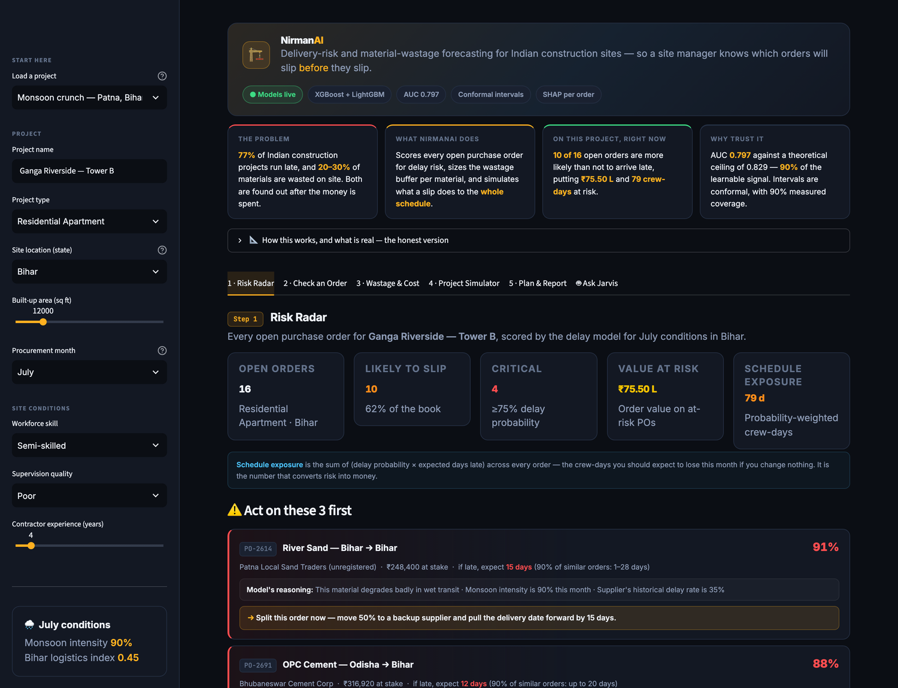
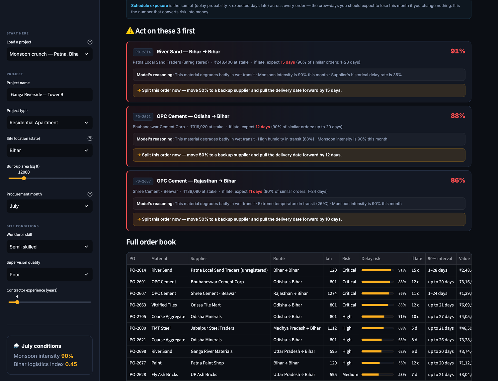
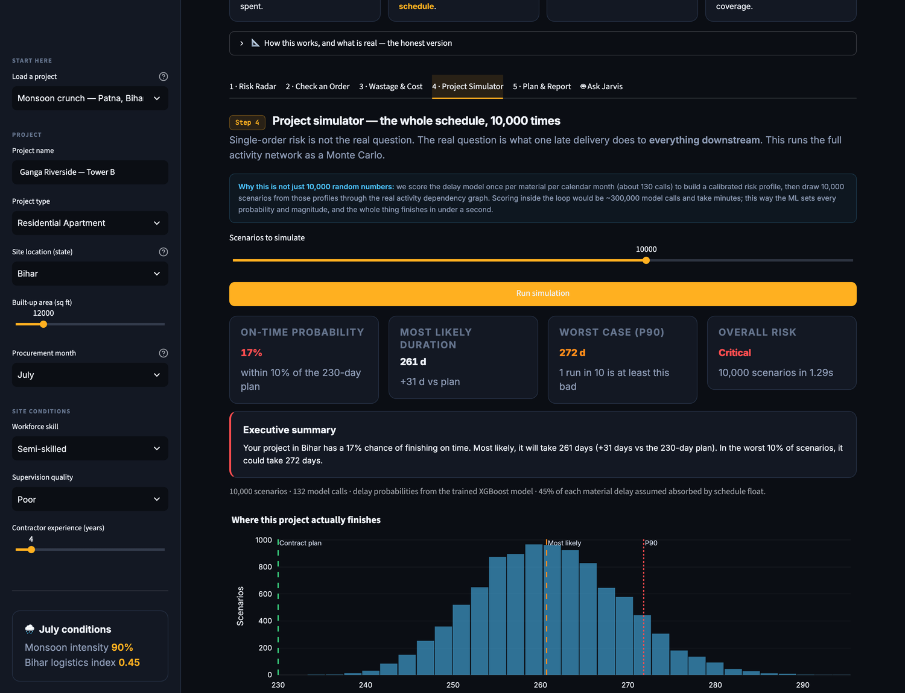

<h1 align="center">NirmanAI</h1>

<p align="center">
  <strong>Delivery-risk and material-wastage forecasting for Indian construction sites —<br>
  so a site manager knows which orders will slip <em>before</em> they slip.</strong>
</p>

<p align="center">
  
  
  
  
  
  
</p>

<p align="center">
  Team Aim-Nexus · IIT Madras · KAYA × IIT India Hackathon 2026
</p>



---

## The problem

Two numbers define construction in India:

- **77%** of projects run late, averaging a 20-month overrun (MoSPI infrastructure project statistics).
- **20–30%** of construction material is wasted on site (CIDC benchmarks) — roughly **₹1.5 lakh crore** a year.

Both are found out *after* the money is spent. A site manager discovers the cement is late when the crew is standing idle, and discovers the wastage when the store runs dry three-quarters of the way through a pour.

The information needed to see either coming already exists — supplier track record, monsoon calendar, corridor logistics quality, festival shutdowns, workforce skill, supervision quality. Nobody puts it together.

## What NirmanAI does

Three things, in the order a site manager needs them:

1. **Scores every open purchase order** for delay probability, expected days late, and a calibrated uncertainty interval — with the reasons the model actually used.
2. **Sizes the wastage buffer per material** from the site's real conditions, so the purchase quantity is right the first time.
3. **Simulates the whole project** 10,000 times to show what one late delivery does downstream — which is the question single-order risk cannot answer.

---

## Quick start

```bash
python setup.py
```

Installs dependencies, generates the datasets, trains both model families, and verifies the artefacts load. Takes about two minutes.

```bash
streamlit run app.py
```

Opens at http://localhost:8501. No API keys required.

Optional REST API:

```bash
uvicorn api:app --reload --port 8000
```

Interactive docs at http://localhost:8000/docs.

> **Deploying?** See **[DEPLOYMENT.md](DEPLOYMENT.md)** — step-by-step for Streamlit
> Community Cloud (dashboard) and Render (REST API), plus the demo-day checklist.

---

## The 3-minute demo path

| # | Where | What to do | What it shows |
|---|-------|-----------|---------------|
| 1 | Sidebar | Load **"Monsoon crunch — Patna, Bihar (July)"** | The whole page re-scores for one project |
| 2 | **1 · Risk Radar** | Read the top alert card | The model names the PO, the probability, the interval, the SHAP drivers, and the one action to take |
| 3 | **4 · Project Simulator** | Hit **Run simulation** | ~17% on-time probability, the full duration distribution, and which material cascades furthest — in under a second |
| 4 | Sidebar | Switch to **"Dry season — Ahmedabad, Gujarat (February)"** | Same product, opposite risk picture — this is the model working, not a static mock-up |
| 5 | **5 · Plan & Report** | Generate plan, then generate report | Risk-weighted buffers, a real Pareto frontier over supplier allocations, and a printable brief |

The Bihar-in-July versus Gujarat-in-February contrast in step 4 is the demo. Nothing is hardcoded; every number moves because the model re-scores.

### Risk Radar — every open order, scored and explained



Each alert names the PO, the probability, the calibrated day range, the SHAP factors the model actually keyed on, and the one action to take. The order book below it is sorted by risk, and the "Top driver" column is that specific order's leading SHAP contributor.

### Project Simulator — 10,000 scenarios in about a second



---

## How it works

```
                    ┌─────────────────┐
 Project context ──►│  Delay models   │──► P(late), days late, 90% interval,
 (state, month,     │  XGB + LGBM     │    SHAP drivers per order
  supplier, route)  └─────────────────┘
                              │
                              ▼
                    ┌─────────────────┐
                    │ Risk profiles   │  ~130 model calls, cached per
                    │ per material    │  (material, calendar month)
                    └─────────────────┘
                              │
                              ▼
 Activity network ──►┌─────────────────┐──► on-time probability, duration
 (dependencies,      │ Monte Carlo     │    distribution, cascade analysis,
  durations)         │ 10,000 runs     │    single points of failure
                     └─────────────────┘
```

### The models

| Component | Model | Measured performance |
|---|---|---|
| Will this delivery be late? | XGBoost classifier, 38 features | **AUC 0.797** |
| How late, if it is? | LightGBM quantile regressor | **MAE 8.0 days** |
| How confident? | Conformal prediction (CQR + split) | **90.3%** empirical coverage at a 90% target |
| How much material is wasted? | LightGBM regressor + 10th/90th quantile models | **MAE 1.89 percentage points** |
| Which band? | LightGBM classifier | **81%** accuracy, 3 classes |
| Why? | SHAP TreeExplainer, per prediction | ~5 ms per order |

### On that AUC number

A delivery either slips or it does not, and the outcome is genuinely partly random. That puts a hard ceiling on any classifier. On this dataset the **Bayes-optimal AUC is 0.829** — a model with perfect knowledge of the underlying risk could do no better.

We score **0.797**, which is **90% of the learnable signal**. The training script computes and prints the ceiling on every run, and the dashboard shows both numbers side by side.

An earlier version of this dataset reported AUC 0.918. That number came from a leaked feature: `traffic_status` was recorded during transit, and "Heavy" meant 100% delayed. Corridor congestion observed *while the truck is late* is a consequence of the delay, not something a buyer knows at order time. The generator now forecasts traffic at order time and gives it a bounded, causal effect. The honest number is lower, and it is the one we report.

### Uncertainty, not point estimates

"Arrives 15 July" is a dangerous thing to tell a site manager. Every delay forecast ships with a conformal prediction interval, which guarantees marginal coverage without assuming anything about the error distribution. Two estimators are trained:

- **Adaptive CQR** (MAPIE) — interval width varies with the order's difficulty.
- **Split conformal** — the (1−α) empirical quantile of absolute residuals on a held-out calibration set. Always available, and the fallback if MAPIE's version differs.

Measured coverage on held-out data is 90.3% against a 90% target.

### Explanations that match the model

Risk factors come from **SHAP values computed for that specific order**, not from an if/else ladder. This matters: a rule list can contradict the model it is supposed to explain, and the previous version did — it printed "no major risk factors detected" on orders the model had scored at 96%.

### The simulator is ML-driven, and fast

Scoring the delay model inside a 10,000-run Monte Carlo would be ~300,000 sklearn calls and take minutes. Instead the model is scored **once per material per calendar month** (~130 calls) to build a calibrated risk profile — probability, expected magnitude, conformal bounds — and the loop draws scenarios from those profiles through the real activity dependency graph.

The ML still sets every probability and magnitude. The whole simulation finishes in under a second.

### Correlated suppliers

Splitting an order across two suppliers does not halve the risk. The same monsoon, the same festival shutdown and the same fuel strike hit both. NirmanAI models a **common-mode correlation** that rises with monsoon intensity (20% baseline, up to 47% in July), so dual sourcing removes the diversifiable portion and no more.

A model assuming independence reports a ~97% risk reduction for the same order book. That number is wrong, and it is the kind of wrong that gets a site manager to skip the schedule buffer they actually need.

The Pareto frontier in the planner is computed by enumerating real allocations across the supplier database and keeping the non-dominated set — every point is an allocation a buyer can actually execute.

---

## What is real, and what is synthetic

Stated plainly, because a hackathon prototype that overclaims is worse than one that underclaims.

| | Status |
|---|---|
| **Models** | Real. Trained, evaluated on held-out data, metrics reported from the actual run. |
| **Training data** | **Synthetic.** Generated from published benchmarks — CIDC wastage ranges, IMD monsoon profiles, state logistics indices, the festival calendar, supplier-tier reliability. The relationships encode domain knowledge; the rows are not real procurement records. |
| **Purchase orders in the dashboard** | **Synthetic**, generated deterministically from the selected project — then scored by the real models. Change the state or month and every row re-scores. |
| **Supplier database** | Curated. 71 real Indian material suppliers with hand-assigned reliability scores and lead times. Inter-state distances are computed from state-capital coordinates with a road-circuity factor — deterministic, not random per call. |
| **Weather** | Seasonal IMD-calibrated profile by default, labelled as such. Live OpenWeatherMap data if `OPENWEATHERMAP_API_KEY` is set. |
| **KAYA Jarvis panel on the Risk Radar** | **Integration concept**, labelled on the panel. The only illustrative element in the dashboard. |

We have no access to real procurement records. Everything above is what we built without them.

---

## Project layout

```
nirmanai/
├── app.py                  # Streamlit dashboard — the demo
├── ui.py                   # Design system: CSS, chart theme, components
├── demo_data.py            # Live order book + wastage forecast, model-scored
├── model_store.py          # Single fault-tolerant loader for every artefact
├── simulation_engine.py    # Monte Carlo + procurement optimiser + Pareto frontier
├── generate_data.py        # Synthetic dataset generator (leak-free by construction)
├── train_delay_model.py    # Delay models, conformal intervals, SHAP explanations
├── train_wastage_model.py  # Wastage regressor, quantile models, classifier
├── suppliers_db.py         # 71 suppliers + deterministic inter-state distances
├── weather.py              # Live weather with a labelled seasonal fallback
├── report_generator.py     # Print-ready site brief (PDF via WeasyPrint, HTML fallback)
├── agent.py                # Jarvis — routes questions to the real engines
├── api.py                  # FastAPI REST layer
├── setup.py                # One-command setup, ending in a load verification
├── templates/report.html   # Report template
├── data/                   # Datasets (committed, so deploys need no build step)
├── models/                 # Trained artefacts + a metrics card (committed)
├── docs/                   # README screenshots
├── DEPLOYMENT.md           # Hosting guide for Streamlit Cloud + Render
├── packages.txt            # Debian deps for WeasyPrint on Streamlit Cloud
├── runtime.txt             # Python version pin for the host
└── notebooks/              # Model development notebooks
```

## Failure modes, and what happens

Every dependency below is optional. None of them can take the demo down.

| If this is missing | What happens |
|---|---|
| Trained models | Dashboard runs on a transparent rule-based fallback and says so in a banner on every load. |
| MAPIE, or a version mismatch | Falls back to the split-conformal quantile. Intervals stay calibrated. |
| SHAP | Falls back to rule-based risk factors, and labels which one produced the explanation. |
| WeasyPrint native libraries | Report exports as HTML instead of PDF, and the download button says so. |
| `GEMINI_API_KEY` | Jarvis routes directly to the simulator, optimiser and supplier database. |
| `OPENWEATHERMAP_API_KEY` | Seasonal monsoon profile, labelled as such. |
| Any single panel throwing | Contained to that panel with a readable message. The rest of the page keeps working. |

## Environment variables

All optional — see `.env.example`.

```
GEMINI_API_KEY            # Conversational layer for Jarvis
OPENWEATHERMAP_API_KEY    # Live weather
NIRMANAI_API_KEY          # Header key for the REST API
```

## Team

| | |
|---|---|
| Abhishek Dhama | Project direction, pitch, domain research |
| Kanchan Dalal | Delay model |
| Ishank Gupta | Wastage model |
| Muskan Jadon | Dashboard, integration |

IIT Madras · BS Data Science · 2026
